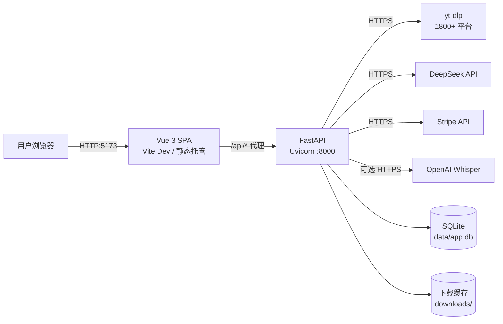

# VidDigest 运维手册

> 本文档面向**运维 / 部署 / 故障排查**场景。开发期的快速启动请看 [README.md](../README.md)，API 细节请看 [API.md](API.md)。

> **会员制不启用**：所有用户统一为每日 3 次免费额度。
> 前端付费入口由 `frontend/src/config/features.js` 的 `MEMBERSHIP_ENABLED = false` 关闭。
> 后端 `api_payment.py`、`is_vip_active()`、`orders` 表与 Stripe 配置位属于契约的一部分，
> 动它们前先读 ADR 0010 / 0012。下方涉及 Stripe 的章节当前无需配置。

---

## 📑 目录

- [1. 部署架构](#1-部署架构)
- [2. 环境要求](#2-环境要求)
- [3. 首次部署](#3-首次部署)
- [4. 配置说明](#4-配置说明)
- [5. 启动 / 关停 / 重启](#5-启动--关停--重启)
- [6. 进程管理（hub）](#6-进程管理hub)
- [7. 日志与监控](#7-日志与监控)
- [8. 数据与备份](#8-数据与备份)
- [9. 故障排查手册](#9-故障排查手册)
- [10. 性能与限流](#10-性能与限流)
- [11. 安全清单](#11-安全清单)
- [11.5 生产静态托管（SPA rewrite）](#115-生产静态托管spa-rewrite)
- [12. 升级与维护](#12-升级与维护)

---

## 1. 部署架构



**核心进程**


| 进程             | 端口   | 依赖                                   | 备注                |
| :--------------: | :----: | ------------------------------------ | ----------------- |
| `backend-api`  | 8000 | Python 3.10+ / yt-dlp / 百炼或 DeepSeek Key（任一组） | FastAPI + Uvicorn |
| `frontend-dev` | 5173 | Node 20.19+ / 22.12+                  | 仅开发期使用，生产替换为静态文件  |


**生产部署时**：前端 `npm run build` → `dist/` 由 Nginx 托管；后端用单进程 Uvicorn + 反向代理。理由见 [5.1.1](#511-后端单进程性能建议不再是正确性约束)。

---

## 2. 环境要求


| 组件      | 最低版本 | 推荐         | 验证命令                |
| ------- | :----: | :----------: | ------------------- |
| Python  | 3.10 | 3.11       | `python --version`  |
| Node.js | 20.19 或 22.12 | 22 / 24 | `node --version`    |
| npm     | 10    | 10+        | `npm --version`     |
| ffmpeg  | 任意   | 最新稳定       | `ffmpeg -version`   |
| SQLite  | 3.x  | 系统自带       | `sqlite3 --version` |
| 磁盘      | —    | ≥ 10 GB 可用 | `downloads/` 会持续增长  |

> **Node 版本不是建议，是硬要求**：Vite 8 的 `engines` 写的是
> `^20.19.0 || >=22.12.0`，Node 18 会在 `npm install` 阶段直接失败。
> `frontend/package.json` 的 `engines` 字段与这张表同源。


**系统级依赖**

```bash
# Windows（管理员 PowerShell）
choco install ffmpeg        # 或手动下载 → 解压 → 把 bin/ 加入 PATH

# macOS
brew install ffmpeg

# Debian/Ubuntu
sudo apt update && sudo apt install -y ffmpeg sqlite3
```

> **ffmpeg 必须**：用于合并 YouTube/B站等分离的视频流（`bestvideo+bestaudio`），缺失会降级为单格式，可能没声音。

---

## 3. 首次部署

### 3.1 拉取代码

```bash
git clone <your-repo-url> viddigest
cd viddigest
```

### 3.2 后端

```bash
cd backend

# 1) 建虚拟环境
python -m venv venv

# 2) 升级 pip + 装依赖
# Windows（绝对路径绕开中文 cwd 转义问题）
"D:/path/to/backend/venv/Scripts/python.exe" -m pip install --upgrade pip
"D:/path/to/backend/venv/Scripts/python.exe" -m pip install -r requirements.txt

# Linux/macOS
source venv/bin/activate
pip install --upgrade pip
pip install -r requirements.txt

# 3) 复制环境变量模板
cp .env.example .env       # Linux/macOS
# Windows: copy .env.example .env

# 4) 编辑 .env 填入密钥（见 §4）
```

### 3.3 前端

```bash
cd frontend
npm install
```

### 3.4 健康检查

```bash
# 后端
curl http://127.0.0.1:8000/api/health        # → {"status":"ok"}

# 前端（开发期）—— 必须用 localhost：Vite 只监听 IPv6 回环
curl -o /dev/null -w "%{http_code}" http://localhost:5173/   # → 200
```

> `127.0.0.1:5173` **连不上**（Vite 绑的是 IPv6 回环 `::1`）。这是本项目最常见的
> 「前端起不来」误判来源。后端 `:8000` 不受此限，用 `127.0.0.1` 或 `localhost` 都可以。

---

## 4. 配置说明

**配置文件**：`backend/.env`（**已在 `.gitignore` 中，不要提交真实密钥**）

### 4.1 变量清单


| 变量                        | 必填  | 默认值                                                 | 用途                                      | 获取                                                                               |
| ------------------------- | :---: | --------------------------------------------------- | --------------------------------------- | -------------------------------------------------------------------------------- |
| `ALIYUN_BAILIAN_API_KEY`  | ✅   | —                                                   | AI 总结 / 导图 / 问答（推荐，最便宜）                 | [https://bailian.console.aliyun.com/](https://bailian.console.aliyun.com/)       |
| `ALIYUN_BAILIAN_BASE_URL` | —   | `https://dashscope.aliyuncs.com/compatible-mode/v1` | 百炼兼容模式端点                                | 用 workspace 专属地址                                                                 |
| `ALIYUN_BAILIAN_MODEL`    | —   | `qwen-turbo`                                        | 模型名（`qwen-turbo` 最便宜，`qwen-plus` 性价比最高） | 百炼模型市场                                                                           |
| `DEEPSEEK_API_KEY`        | ✅   | —                                                   | AI 总结 / 导图 / 问答（与百炼二选一）                  | [https://platform.deepseek.com/api_keys](https://platform.deepseek.com/api_keys) |
| `JWT_SECRET`              | ✅   | 无默认值（缺失或纯空白则拒绝启动）                        | JWT 签名密钥                                | `openssl rand -hex 32`（32+ 位随机串）                                                  |
| `VIDDIGEST_ADMIN_EMAILS`  | —   | 空（合法：没有管理员）                                    | 首个管理员播种，逗号分隔；见 §10.4          | 就是目标账号的邮箱，逗号分隔                                                           |
| `OPENAI_API_KEY`          | —   | —                                                   | 视频无字幕时 Whisper ASR 回退                   | [https://platform.openai.com/api-keys](https://platform.openai.com/api-keys)     |
| `STRIPE_SECRET_KEY`       | —   | —                                                   | 支付服务接入                                  | [https://dashboard.stripe.com/apikeys](https://dashboard.stripe.com/apikeys)     |
| `STRIPE_PRICE_ID_MONTHLY` | —   | —                                                   | 月订阅价格 ID                                | Stripe Dashboard → Products                                                      |
| `STRIPE_WEBHOOK_SECRET`   | —   | —                                                   | Webhook 验签                              | Stripe Dashboard → Webhooks                                                      |
| `FRONTEND_URL`            | —   | `http://localhost:5173`                             | 支付成功跳转                                  | 按实际前端地址填                                                                         |


### 4.2 模板

```env
# ─── AI（必填，配置任一组即可；阿里云百炼最便宜）──
# 阿里云百炼：填写 ALIYUN_BAILIAN_API_KEY 即可，默认模型 qwen-turbo
ALIYUN_BAILIAN_API_KEY=sk-your-bailian-key
ALIYUN_BAILIAN_MODEL=qwen-turbo
# 或 DeepSeek（两组配任意一组即可，程序按非空的那组选用）
DEEPSEEK_API_KEY=

# ─── 安全（必填，缺失则进程拒绝启动）─────────────
# JWT_SECRET 没有默认值。写死一个兜底常量等于让猜中常量的人
# 伪造任意管理员 token，所以缺失或纯空白时直接拒绝启动。见 ADR 0010。
JWT_SECRET=<把下面命令的输出粘进来>        # openssl rand -hex 32

# ─── 支付（可选）───────────────────────────────
STRIPE_SECRET_KEY=sk_test_xxx
STRIPE_PRICE_ID_MONTHLY=price_xxx
STRIPE_WEBHOOK_SECRET=whsec_xxx
FRONTEND_URL=https://your-domain.com

# ─── ASR 回退（可选）──────────────────────────
OPENAI_API_KEY=sk-your-openai-key
```

### 4.3 配置生效


| 方式                            | 是否需要重启                        |
| ----------------------------- | :-----------------------------: |
| 编辑 `backend/.env`             | **是**（`python-dotenv` 在启动时加载） |
| 操作系统环境变量                      | **是**                         |
| 容器化部署时 K8s ConfigMap / Secret | **是**（滚动重启）                   |


---

## 5. 启动 / 关停 / 重启

### 5.1 后端

```bash
cd backend

# ── 方式 A：hub 后台托管（推荐） ──
hub start --name backend-api \
  --application "D:/path/to/backend/venv/Scripts/python.exe" \
  --args "-m uvicorn main:app --host 0.0.0.0 --port 8000" \
  --cwd "D:/path/to/backend" \
  --ready "log=Uvicorn running on" --port 8000

# Linux 等价
hub start --name backend-api \
  --application "$(pwd)/venv/bin/python" \
  --args "-m uvicorn main:app --host 0.0.0.0 --port 8000" \
  --cwd "$(pwd)" \
  --ready "log=Uvicorn running on" --port 8000

# ── 方式 B：前台跑（看实时日志） ──
python -m uvicorn main:app --host 0.0.0.0 --port 8000
# Ctrl+C 退出

# ── 方式 C：项目入口 ──
python main.py

# ── 重启（改了代码） ──
hub restart --name backend-api

# ── 关停 ──
hub stop --name backend-api
```

### 5.1.1 后端单进程（性能建议，不再是正确性约束）

**当前仍建议单进程**，但它的理由变了：SQLite 的**写入是串行**的，多 worker 不
能提升写吞吐，只会让写锁竞争与 `database is locked` 更频繁。

⚠️ **这一节以前是正确性硬约束，工单 #20 已解除。** 留着这段历史是因为「不能加
worker」这句话仍在多处出现，而它的理由已经换了——照着旧理由做判断会得出
「闸门还在内存里、所以绝对不能多进程」的错误结论。

旧约束的来源：覆盖闸门曾是 `api_summarize.py` 里的一个**进程内 `set[str]`**，
`--workers 2` 会把它劈成两份互不可见的副本，于是同一个作者并发点两次覆盖时两个
进程都判定「可以覆盖」——两次调模型、两次扣额度、结果互相覆盖，**不报错、
不告警**。

现在闸门是 `videos` 表上的两列（`regenerating_by` / `regenerating_at`），抢锁是
一条带条件的 UPDATE，而 SQLite 串行化写事务——两个 worker 同时抢只有一个拿到。
**两条路径（首次解析与覆盖）现在用的是同一种机制**：单条条件写 + 唯一裁决。
设计取舍与代价见 [ADR 0015](adr/0015-regenerate-gate-in-db.md)。

要加 worker 时真正要盯的：

- **SQLite 写入串行**：写并发不会变快，且单次写事务超过 5 秒时会 `database is locked`。
- **覆盖闸门的 TTL**：`VIDDIGEST_VIDEO_REGENERATE_TTL_SECONDS`（默认 1800 秒）
  必须大于一次覆盖的最长耗时，否则会在持闸者还在干活时把锁偷走。

关于 SQLite 本身：`database.py:211` 的 `sqlite3.connect(get_db_path())` 没传
`timeout`，走 Python 默认的 **5.0 秒**等待窗口（2026-10-06 实测：持锁 2s 的写者
让另一方等 1.62s 后成功；持锁 7s 则等满 5.5s 后抛 `database is locked`）。
所以**单进程下也可能偶发** `database is locked`——那说明有超过 5 秒的长事务
（备份、批量删除、schema 迁移），不是「上多进程了」。

### 5.2 前端

```bash
cd frontend

# ── 方式 A：hub 后台托管 ──
# ⚠️ 中文路径 + npx 会触发 PTY \0 注入 bug，必须用绝对路径 node
hub start --name frontend-dev \
  --application node \
  --args "node_modules/vite/bin/vite.js --host 0.0.0.0 --port 5173 --strictPort" \
  --cwd "D:/path/to/frontend" \
  --ready "log=VITE.*ready" --port 5173

# ── 方式 B：npm scripts ──
npm run dev                                  # 5173，被占时自动跳端口
npm run dev -- --port 5173 --strictPort      # 强占 5173
npm run dev -- --host 0.0.0.0                # 局域网可访问

# ── 生产构建 ──
npm run build       # → dist/，由 Nginx/CDN 托管
npm run preview     # 本地预览生产构建

# ── 重启（改了 vite.config.js 才需要，普通代码 HMR 自动刷新） ──
hub restart --name frontend-dev

# ── 关停 ──
hub stop --name frontend-dev
```

### 5.3 一键全启 / 全停

```bash
# 全启
hub start --name backend-api --application "<venv-python>" --args "-m uvicorn main:app --host 0.0.0.0 --port 8000" --cwd "<backend-dir>" --ready "log=Uvicorn running on" --port 8000
hub start --name frontend-dev --application node --args "node_modules/vite/bin/vite.js --host 0.0.0.0 --port 5173 --strictPort" --cwd "<frontend-dir>" --ready "log=VITE.*ready" --port 5173

# 全停
hub stop --name backend-api
hub stop --name frontend-dev
```

### 5.4 systemd 守护（Linux 生产）

`<app>` 是部署方自己定的服务名与安装根目录（下面用 `<app>` 占位，不要照抄字面量）。
单元文件放在 `/etc/systemd/system/<app>-backend.service`：

```ini
[Unit]
Description=VidDigest Backend (FastAPI)
After=network.target

[Service]
Type=simple
User=www-data
WorkingDirectory=/opt/<app>/backend
EnvironmentFile=/opt/<app>/backend/.env
ExecStart=/opt/<app>/backend/venv/bin/python -m uvicorn main:app --host 0.0.0.0 --port 8000
# 不要加 --workers：SQLite 写入串行，加 worker 不提升写吞吐（工单 #20 后
# 这已不是正确性约束——覆盖闸门落库了，理由见 5.1.1 与 ADR 0015）
Restart=on-failure
RestartSec=5

[Install]
WantedBy=multi-user.target
```

> 密钥走 `EnvironmentFile` 指向 `.env`，不要写成 `Environment=` 行内赋值 ——
> unit 文件是纯文本，进程列表和 `systemctl show` 都能读到行内值。

```bash
sudo systemctl daemon-reload
sudo systemctl enable --now <app>-backend
sudo systemctl status <app>-backend
```

### 5.5 测试账号（演示 / 压测 / 联调用）

> **凭据由部署方自定，本文不提供任何账号口令。**
> 仓库是 PUBLIC：把口令写进运维手册，等于把一份可用的登录凭据公开贴在 README 上，
> 与 `.gitignore` 里已经确立的「含明文口令的清单不入版本库」是同一条规矩。
> 本地开发库自带的测试账号清单是 `TEST_ACCOUNTS.md`，它同样在 `.gitignore` 里 ——
> 需要时看本机磁盘，不要指望从 git 里取。

需要两类账号，一类覆盖**免费额度受限**路径，一类覆盖**额度不设限**路径。

| 用途 | 账号 | 额度 | 覆盖场景 |
|------|------|:----:|----------|
| 免费用户 | 自定（建议用 RFC 6761 保留 TLD，如 `<name>.test`） | 3 次/日 | 配额限制、付费引导弹窗、错误文案 |
| 不限额度 | 自定 | 无限 | 总结 / 导图 / 问答的完整路径 |

口令与邮箱都从环境变量读，不落在命令行历史里：

```bash
export TEST_USER_EMAIL='<free-user>.test'
export TEST_USER_PASSWORD="$(openssl rand -base64 18)"
export TEST_VIP_EMAIL='<unlimited>.test'
export TEST_VIP_PASSWORD="$(openssl rand -base64 18)"

# 1) 注册（走标准 /api/auth/register，密码经 bcrypt 哈希）
for pair in "$TEST_USER_EMAIL:$TEST_USER_PASSWORD" "$TEST_VIP_EMAIL:$TEST_VIP_PASSWORD"; do
  curl -sS -X POST http://127.0.0.1:8000/api/auth/register \
    -H "Content-Type: application/json" \
    -d "{\"email\":\"${pair%%:*}\",\"password\":\"${pair##*:}\"}"
  echo
done
```

**把不限额度账号的额度置为无限**（直接改库，不走支付）：

```bash
"<venv-python>" - <<'PY'
import os, sqlite3
conn = sqlite3.connect('backend/data/app.db')
conn.execute(
    "UPDATE users SET parse_limit_override=-1, chat_limit_override=-1 WHERE email=?",
    (os.environ["TEST_VIP_EMAIL"],),
)
conn.commit()
conn.close()
print("ok")
PY
```

> `parse_limit_override` / `chat_limit_override` 取值：`0` = 一条都不能用，`-1` = 无限，`NULL` = 用全局默认。
> 给有效 VIP 设覆盖不生效 —— VIP 在上限校验之前就短路了。

**重置账号（如被压测数据污染）**

```bash
"<venv-python>" - <<'PY'
import os, sqlite3
conn = sqlite3.connect('backend/data/app.db')
conn.execute("DELETE FROM users WHERE email IN (?, ?)",
             (os.environ["TEST_USER_EMAIL"], os.environ["TEST_VIP_EMAIL"]))
conn.commit()
conn.close()
print("ok")
PY
```

**自动化测试**：CI 需要的凭据由 CI 自己的 secret 注入，不写进任何入库文件。
免费用户每天解析 3 次、追问 10 次（见 §10.3），连续跑测试前先把
`VIDDIGEST_DAILY_PARSE_LIMIT` / `VIDDIGEST_DAILY_CHAT_LIMIT` 调大，或清掉
`daily_parse_count` / `daily_chat_count` 字段。

## 6. 进程管理（hub）

`hub` 是 omp 自带的进程编排器，所有长跑进程都应托管在它下面。

### 6.1 常用命令


| 命令                                                                                     | 作用                      |
| -------------------------------------------------------------------------------------- | ----------------------- |
| `hub start --name <n> --application <exe> --args <argv...> --cwd <dir> --ready <expr>` | 启动并等待就绪                 |
| `hub stop --name <n>`                                                                  | 优雅停止（SIGTERM → SIGKILL） |
| `hub restart --name <n>`                                                               | 复用启动配置重启                |
| `hub ps`                                                                               | 列出当前项目托管的所有进程           |
| `hub describe --name <n>`                                                              | 查看启动参数 + 状态             |
| `hub logs --name <n>`                                                                  | 最近 100 行日志              |
| `hub logs --name <n> --follow`                                                         | 实时跟随日志                  |
| `hub logs --name <n> --grep "ERROR"`                                                   | 过滤关键字                   |
| `hub send --name <n> --text "..."`                                                     | 给进程 stdin 发命令           |


### 6.2 启动配置示例

```bash
# --ready 同时匹配日志 + 端口，两个条件都必须满足才视为就绪
hub start --name backend-api \
  --application "D:/path/venv/Scripts/python.exe" \
  --args "-m uvicorn main:app --host 0.0.0.0 --port 8000" \
  --cwd "D:/path/backend" \
  --ready "log=Uvicorn running on" --port 8000 \
  --restart on-failure
```


| `--restart`  | 行为             |
| ------------ | -------------- |
| `no`（默认）     | 失败不重启          |
| `on-failure` | 异常退出自动重启（指数退避） |
| `always`     | 不管退出码都重启       |


### 6.3 故障排查起步

```bash
hub ps                              # 看进程状态 / uptime / restarts
hub describe --name backend-api     # 看启动参数是否正确
hub logs --name backend-api --tail 200 --grep "ERROR"
hub logs --name backend-api --follow
```

---

## 7. 日志与监控

### 7.1 日志位置


| 来源           | 位置                                         | 用途              |
| ------------ | ------------------------------------------ | --------------- |
| backend-api  | `hub logs --name backend-api`              | Uvicorn 访问 + 异常 |
| frontend-dev | `hub logs --name frontend-dev`             | Vite HMR + 编译错误 |
| yt-dlp 调试    | 进程内拿不到细节（`downloader.py` 固定 `quiet` + `no_warnings`）；在 `backend/` 下手动跑 `venv/Scripts/yt-dlp -v --no-playlist "<视频链接>"` 看 stderr | 抓取失败详情          |
| SQLite       | `backend/data/app.db`                      | 用户 / 订单 / 摘要计数  |


### 7.2 关键监控点

```bash
# 1) 后端存活
curl -fs http://127.0.0.1:8000/api/health || alert "Backend down"

# 2) 前端可达（注意：Vite 只监听 IPv6 回环，127.0.0.1 连不上）
curl -fs -o /dev/null http://localhost:5173/ || alert "Frontend down"

# 3) 代理链路
curl -fs http://localhost:5173/api/health || alert "Vite proxy broken"

# 4) 磁盘空间（downloads 增长快）
du -sh backend/downloads/ && df -h backend/

# 5) 数据库大小
ls -lh backend/data/app.db

# 6) yt-dlp 更新（每月一次）
"D:/path/venv/Scripts/python.exe" -m pip install --upgrade yt-dlp
```

### 7.3 推荐告警阈值


| 指标                        | 阈值          | 处置                   |
| ------------------------- | ----------- | -------------------- |
| `backend-api` uptime 重启次数 | 1h 内 ≥ 3 次  | 看 `hub logs` 查 panic |
| `/api/health` 连续失败        | 30s 内 3 次   | 重启后端                 |
| `downloads/` 大小           | &gt; 10 GB  | 清理旧文件                |
| `data/app.db` 大小          | &gt; 500 MB | 归档 + 重建索引            |
| 磁盘剩余                      | &lt; 10%    | 紧急清理                 |


---

## 8. 数据与备份

### 8.1 数据位置


| 数据             | 路径                       | 是否备份          |
| -------------- | ------------------------ | :-------------: |
| 用户 / 订单 / 摘要计数 | `backend/data/app.db`    | ✅             |
| 下载缓存           | `backend/downloads/`     | ⛔ 可重建         |
| yt-dlp 缓存      | 用户家目录 `~/.cache/yt-dlp/` | ⛔ 可重建         |
| `.env`         | `backend/.env`           | ✅ **绝不入 git** |


### 8.2 备份策略

```bash
# 每日凌晨 3 点归档（crontab 示例；<app> 与备份根目录按你的部署填）
0 3 * * * sqlite3 /opt/<app>/backend/data/app.db ".backup '/backup/<app>-$(date +\%Y\%m\%d).db'"

# 手动备份
cp backend/data/app.db backup/app-$(date +%Y%m%d).db

# 手动恢复
cp backup/app-20260101.db backend/data/app.db
hub restart --name backend-api
```

### 8.3 重置数据库

```bash
# ⚠️ 会清空所有用户、订单、摘要计数
rm -f backend/data/app.db
hub restart --name backend-api      # lifespan 启动时会自动重建表结构
```

---

## 9. 故障排查手册

### 9.1 启动类


| 症状                                               | 原因                     | 解决                                                                       |
| ------------------------------------------------ | ---------------------- | ------------------------------------------------------------------------ |
| `ModuleNotFoundError: No module named 'fastapi'` | venv 没建 / 没装           | `venv/Scripts/python -m pip install -r requirements.txt`                 |
| `python: can't open file 'main.py'`              | cwd 错误                 | `cd backend` 后再启动                                                        |
| uvicorn 端口被占                                     | 8000 被别的进程占            | `netstat -ano | grep 8000` 杀 PID 或换 `--port 8001`                        |
| vite 端口跳到 5174/5175                              | 5173 被旧实例占             | `taskkill /F /PID <pid>` + 加 `--strictPort`                              |
| hub 启动报 `CreateProcessW ... 不是有效的 Win32 应用程序`    | 中文 cwd + npx 触发 \0 bug | 用绝对路径 `node node_modules/vite/bin/vite.js`                               |
| `未检测到 AI 服务 API Key，请配置以下任一组环境变量`（`ValueError`） | `.env` 缺失或没填           | 复制 `.env.example` → 填 `ALIYUN_BAILIAN_API_KEY`（推荐）或 `DEEPSEEK_API_KEY` → 重启 |
| `RuntimeError: 缺少环境变量 JWT_SECRET`               | `.env` 漏配 / 配了纯空白 / 启动进程读不到 | `openssl rand -hex 32` 生成 64 位随机串，写进 `backend/.env` 后重启            |


### 9.2 运行时类


| 症状                                          | 原因                        | 解决                                  |
| ------------------------------------------- | ------------------------- | ----------------------------------- |
| 前端 `404 Not Found` 但后端 200                  | vite 代理被旧实例顶掉             | `taskkill` 旧 vite → 重启 frontend-dev |
| `GET /api/health` 通过 5173 代理 404            | 同上                        | 同上                                  |
| 视频解析失败 `Unable to extract ...`              | yt-dlp 版本过期               | `pip install --upgrade yt-dlp`      |
| 下载视频有画面无声音                                  | 没装 ffmpeg                 | 安装 ffmpeg 并加入 PATH                  |
| `抖音解析失败`                                    | 短链过期 / 接口变更               | 重试 + 升级 yt-dlp                      |
| AI 总结 `请先登录`                                | 未鉴权                       | 注册 / 登录后重试                          |
| AI 总结 `今日次数已用完`                             | 免费配额 3 次/日                | 等次日重置（当前无会员制）                   |
| AI 总结 `没有可用的字幕`                             | 视频无字幕轨                    | 上传视频不会支持；选有字幕的视频                    |
| AI 总结无响应 / 卡住                               | DeepSeek 限流 / 网络          | 看 `hub logs` + 重试                   |
| Stripe 支付 500                               | 缺少 `STRIPE_SECRET_KEY`    | 填 `.env` 并重启                        |
| Webhook 400 `Webhook secret not configured` | 缺 `STRIPE_WEBHOOK_SECRET` | 同上                                  |
| 注册 400 `邮箱或密码错误`                            | 用 username 而不是 email      | 必须用邮箱登录                             |
| Bearer token 401 但 token 复制正确               | curl 在 Windows 长 token 截断 | 用 httpx / Postman / 浏览器测试           |


### 9.3 网络类


| 症状                 | 原因                      | 解决                                                                            |
| ------------------ | ----------------------- | ----------------------------------------------------------------------------- |
| yt-dlp 调用平台超时      | 国内访问 YouTube/Twitter 困难 | 配置代理：环境变量 `HTTPS_PROXY=http://127.0.0.1:<proxy-port>`                                 |
| DeepSeek 502 / 超时  | DeepSeek 服务端问题          | 重试；切换 OpenAI 兼容接口                                                             |
| Stripe webhook 收不到 | 公网回调不通                  | 用 `stripe listen --forward-to http://127.0.0.1:8000/api/payment/webhook` 本地测试 |


### 9.4 数据类


| 症状                   | 原因               | 解决                                    |
| -------------------- | ---------------- | ------------------------------------- |
| `database is locked` | 某次写事务持有写锁**超过 5 秒**（Python `sqlite3.connect` 默认等待窗口，见 5.1.1）；常见来源是备份、批量删除、schema 迁移 | 查是不是有长事务。加 `--workers` 既治不了它（SQLite 写入串行），也不再有静默失效风险——覆盖闸门已落库（ADR 0015）；但也**不会**因此变快 |
| 用户列表错乱               | 升级数据库 schema 没迁移 | 看 `database.py` 是否有 `ALTER TABLE`，手动补 |
| **AI 总结一直"正在分析"但无任何事件** | `vip_expire_at` 是 naive datetime，与带时区的 `datetime.now(timezone.utc)` 比较抛 TypeError；异常发生在 SSE `try` 块**之前**，前端拿不到 error 事件就一直转圈 | 读取侧 `is_vip_active` / `complete_order` 对 `tzinfo is None` 做兜底。**写入侧要求**：所有 `vip_expire_at` 统一用 `datetime.now(timezone.utc).isoformat()`（带 `+00:00`） |


---

## 10. 性能与限流

### 10.1 当前瓶颈

- **yt-dlp 解析**：单次 2-8s，受平台反爬影响
- **DeepSeek 流式生成**：受 prompt 长度 + token 速率影响，通常 10-30s
- **下载文件大小**：受 `downloads/` 磁盘限制

### 10.2 调优建议


| 场景           | 调优                                                    |
| ------------ | ----------------------------------------------------- |
| 高并发解析        | 闸门已落库（ADR 0015），不再有静默失效风险；加 `--workers` 前真正要盯的是 **SQLite 写入串行**（加 worker 不提升写吞吐）与**覆盖闸门 TTL**（`VIDDIGEST_VIDEO_REGENERATE_TTL_SECONDS` 必须大于一次覆盖的最长耗时，否则会在持闸者还在干活时把锁偷走）。详见 5.1.1                      |
| 下载慢          | 上 CDN / 引导用户用直链 `/api/direct-url`                     |
| AI 总结排队      | 换 PostgreSQL + Celery；当前是同步 + SSE                     |
| downloads 爆盘 | 加 cron `find backend/downloads -mtime +1 -delete` 每天清 |


### 10.3 免费用户配额

由**环境变量**控制，改后重启后端生效（发版前在 `backend/.env` 里设）：

| 环境变量 | 默认 | 管什么 |
|:--|--:|:--|
| `VIDDIGEST_DAILY_PARSE_LIMIT` | 3 | 每日可发起的解析次数（产出总结 + 思维导图 + 标签） |
| `VIDDIGEST_DAILY_CHAT_LIMIT` | 10 | 每日可发起的追问次数 |

两个计数器彼此独立、各自按 UTC 日期重置。共享内容（读社区视频的总结、思维导图、标签、字幕）不消耗任何额度。

调参入口是环境变量，不是 `database.py` 里的常量——改常量会在下一次改代码时被覆盖。

**以上是全局默认。** 单个用户的例外走管理后台的「额度」页签，
落在 `users` 表的 `parse_limit_override` / `chat_limit_override` 两列
（可空，NULL = 用全局）。取值：`0` = 一条都不能用，`-1` = 无限。

两个坑：

1. **给有效 VIP 设覆盖不生效**。VIP 走的是无限额度，额度校验在解析
   上限**之前**就短路了。覆盖值照写不误（VIP 到期后该生效），
   但界面会明说此刻不生效——不提示的话，管理员会以为是自己改错了。
2. 覆盖是**每用户**的，与两个环境变量无关。改了环境变量不会重置
   已有的覆盖值，要回落得在后台清空。

---

### 10.4 管理员播种

**第一个管理员不能从界面上产生**——能进后台的人才能提权，而进后台
本身就需要管理员。所以是启动时从环境变量播种一次：

```env
# 逗号分隔，首尾空格会被 strip，跳过空串。不做大小写折叠。
VIDDIGEST_ADMIN_EMAILS=you@example.com,other@example.com
```

三条语义要记住：

- **只播种，不同步**。从 `.env` 里删掉一个邮箱**不会**撤销他的管理员身份。
  撤销是人的操作，不是配置的副作用——否则 env 少写一个字符就会在下次
  重启时静默削掉一个管理员。
- **未配置是合法配置**。返回 0，不报错、不播种。
- 账号必须**已存在**才能被播种。播种是 `UPDATE` 不是 `INSERT`，
  先注册再重启。

改完 `.env` 要**重启后端**才生效（`main.py` 没有 `--reload`）。

之后的管理员增减走后台的 SQLite：`UPDATE users SET is_admin = 1 WHERE email = ?`。
提权与撤权**下一次请求即生效**——管理员身份不进 JWT，每次请求回查数据库。

---

## 11. 安全清单


| 项                          | 状态  | 建议                                 |
| -------------------------- | :---: | ---------------------------------- |
| `JWT_SECRET` 无默认值且必填      | ✅   | fail-fast：缺失或纯空白即拒绝启动（ADR 0010） |
| `.env` 不入 git              | ✅   | `.gitignore` 已包含                   |
| CORS `allow_origins=["*"]` | ⚠️  | 生产改为具体域名                           |
| bcrypt 哈希密码                | ✅   | cost=12 默认                         |
| JWT 过期 72h                 | ✅   | 短 token + refresh token 更安全        |
| Stripe Webhook 验签          | ✅   | `STRIPE_WEBHOOK_SECRET` 必填         |
| 上传文件大小限制                   | ➖   | 不适用——后端零上传端点，视频只收链接（见 9.2）          |
| HTTPS                      | ⚠️  | 生产必须（Nginx + Let's Encrypt）        |
| 平台 API Key 不暴露前端              | ✅   | 只走后端（`backend/.env`）。**BYOK 用户自带 Key 是例外**：明文存于浏览器 `localStorage`，随请求体上送，后端不落库（ADR 0004） |
| 速率限制                       | ⛔   | 当前未做，建议加 slowapi / Nginx limit_req |


**生产前必做**：

```bash
# 1) 生成强 JWT 密钥
openssl rand -hex 32

# 2) 改 CORS 允许的来源（main.py）
allow_origins=["https://your-domain.com"]

# 3) 启用 HTTPS（Nginx 配置示例）
server {
  listen 443 ssl;
  server_name api.your-domain.com;
  ssl_certificate /etc/letsencrypt/live/api.your-domain.com/fullchain.pem;
  ssl_certificate_key /etc/letsencrypt/live/api.your-domain.com/privkey.pem;

  location / {
    proxy_pass http://127.0.0.1:8000;
    proxy_set_header Host $host;
    proxy_set_header X-Real-IP $remote_addr;
    proxy_set_header X-Forwarded-For $proxy_add_x_forwarded_for;
    proxy_set_header X-Forwarded-Proto $scheme;
  }
}
```

---

## 11.5 生产静态托管（SPA rewrite）

> **这一节是工单 #15 补的。** 之前 §1 写「`dist/` 由 Nginx 托管」，
> 但没给配置 —— 而托管这份产物**必须**带 rewrite，否则生产上用户刷新 `/admin`
> 直接 404。

### 11.5.1 为什么必须有 rewrite

前端是**轻路由**：`App.vue` 的 `pageFromPath` 靠 `location.pathname` 判断，
`/admin` 与 `/admin/` 落到 admin 页，其余落首页。这条路径只在浏览器里跑，
静态服务器看到 `/admin` 会当成一个真实文件去找，找不到就 404。

Vite dev 有 history fallback，所以**开发期完全正常** —— 这个 bug 只在生产暴露。
同理 `npm run preview` 也有 fallback，**不能用它验证 rewrite 配置对不对**
（它会把缺失的 rewrite 掩盖掉）。

### 11.5.2 发布前：先做一次干净构建

`vite build` 默认会清空 `outDir`（`emptyOutDir` 对 `outDir` 在 `root` 内时默认开），
但本地开发时反复构建会在 `dist/assets/` 留下**多代哈希产物**（文件名带内容哈希，
旧的不会被自动清掉，除非整目录重建）。发布整个 `dist/` 就等于把陈旧 bundle 一起推上线。

**用 `npm run release:build`**（= `clean` + `vite build`），它先整目录删干净再构建：

```bash
cd frontend
npm run release:build              # 发布用这个
# 确认 assets/ 里只有 index.html 实际引用的那一代
grep -o 'assets/[^"]*' dist/index.html | sort -u
ls -la dist/assets/
```

两处应当**一一对应**。对不上就是有陈旧产物，再跑一次 `npm run release:build`。
（日常开发用 `npm run build` 即可，不必每次清空。）

### 11.5.3 Nginx：同域托管 + API 反代

前端所有 API 都是**同源相对路径**（`api/*.js` 里全是 `/api/...`），
`vite.config.js` 的 `server.proxy` **只在 dev 生效**。生产必须把 `/api/*` 反代到后端。

```nginx
server {
  listen 80;
  server_name your-domain.com;   # ← 换成实际域名
  return 301 https://$host$request_uri;
}

server {
  listen 443 ssl;
  server_name your-domain.com;   # ← 换成实际域名
  ssl_certificate     /etc/letsencrypt/live/your-domain.com/fullchain.pem;
  ssl_certificate_key /etc/letsencrypt/live/your-domain.com/privkey.pem;

  root /opt/<app>/frontend/dist;
  index index.html;

  # ── API 反代（必须在 rewrite 之前，见下方顺序说明）──
  location /api/ {
    proxy_pass http://127.0.0.1:8000;
    proxy_set_header Host              $host;
    proxy_set_header X-Real-IP         $remote_addr;
    proxy_set_header X-Forwarded-For   $proxy_add_x_forwarded_for;
    proxy_set_header X-Forwarded-Proto $scheme;

    # SSE：`/api/summarize` 与 `/api/chat` 是流式的。
    # 不关缓冲的话 Nginx 会攒着一起发，界面就一直转圈。
    proxy_buffering off;
    proxy_cache off;
    proxy_read_timeout 600s;   # AI 总结 + 思维导图可能跑几分钟
    proxy_send_timeout 600s;
  }

  # ── 带哈希的构建产物：可以长缓存 ──
  location /assets/ {
    expires 1y;
    add_header Cache-Control "public, immutable";
    access_log off;
  }

  # ── SPA rewrite（关键一条）──
  # 未知路径回 index.html，让前端路由接手。
  # `try_files $uri $uri/ /index.html;` 最后的兜底就是这一行的全部作用。
  location / {
    try_files $uri $uri/ /index.html;
  }

  # favicon / manifest 等根级静态文件：存在就直出，不存在才走 SPA
  location = /favicon.svg { try_files $uri =404; }
  location = /browserconfig.xml { try_files $uri =404; }
  location = /site.webmanifest { try_files $uri =404; }
}
```

**顺序为什么重要**：`location /api/` 必须在 `location /` 之前或用更长的前缀匹配。
若 rewrite 那条先命中，`/api/xxx` 会被回成 `index.html`，前端拿到一段 HTML
去 `JSON.parse` → 500，且日志里看不到明显的路由错误。

### 11.5.4 上线后自检

```bash
# 1) 主页
curl -sS -o /dev/null -w '%{http_code}\n' https://your-domain.com/          # 200

# 2) SPA rewrite 真的生效（这一条就是本节存在的理由）
curl -sS -o /dev/null -w '%{http_code}\n' https://your-domain.com/admin     # 200，且是 index.html
curl -sS https://your-domain.com/admin | head -5                            # 应看到 <!DOCTYPE html> / <div id="app">

# 3) API 没被 rewrite 吃掉
curl -sS https://your-domain.com/api/health                                 # {"status":"ok"}

# 4) 静态产物正常
curl -sS -o /dev/null -w '%{http_code}\n' https://your-domain.com/favicon.svg
```

第 2 条返回 404 = rewrite 没生效；返回 200 但第 3 条返回 HTML = rewrite 盖住了 API。

### 11.5.5 其它静态托管平台

Caddy：

```caddyfile
your-domain.com {
  handle /api/* {
    reverse_proxy 127.0.0.1:8000
    flush_interval -1          # SSE
  }
  handle {
    root * /opt/<app>/frontend/dist
    try_files {path} /index.html
    file_server
  }
}
```

Nginx 之外的平台（对象存储 + CDN、Vercel、Netlify 等）**通常自带 SPA fallback**，
但要逐个确认：不少平台的默认规则只对 `/index.html` 生效，**不覆盖 `/admin` 这类无扩展名路径**。
以平台实际行为为准，别假设。

---

## 12. 升级与维护

### 12.1 依赖升级

```bash
# 后端
"D:/path/venv/Scripts/python.exe" -m pip install --upgrade pip
"D:/path/venv/Scripts/python.exe" -m pip install --upgrade -r requirements.txt

# 前端
cd frontend && npm update
npm outdated       # 看哪些有更新

# 强制升级 yt-dlp（解决平台兼容问题最常见）
"D:/path/venv/Scripts/python.exe" -m pip install --upgrade yt-dlp
```

### 12.2 数据库迁移

当前用 SQLite + 应用启动时 `init_db()` 建表。schema 变更时：

1. 改 `database.py` 中建表语句
2. 或加兼容的 `ALTER TABLE` 逻辑
3. 重启服务

### 12.3 回滚

```bash
# 代码回滚
git log --oneline -10
git checkout <commit-hash> -- backend/ frontend/
hub restart --name backend-api
hub restart --name frontend-dev

# 数据库回滚
cp backup/app-20260101.db backend/data/app.db
hub restart --name backend-api
```

### 12.4 升级 checklist

- [ ] 备份 `data/app.db`
- [ ] 备份 `.env`
- [ ] 看 `git log` 与 `docs/adr/` 是否有破坏性变更
- [ ] 在 staging 环境跑通
- [ ] **前端做一次干净构建**，确认 `dist/assets/` 与 `dist/index.html` 的引用一一对应（见 [11.5.2](#1152-发布前先做一次干净构建)）
- [ ] 确认静态托管的 **SPA rewrite** 生效（`curl https://<域名>/admin` 返回 200 且是 index.html，见 [11.5.4](#1154-上线后自检)）
- [ ] 确认 `/api/*` 反代没被 rewrite 盖住（`curl https://<域名>/api/health` 返回 JSON）
- [ ] 生产滚动升级（先停前端再停后端，避免半截状态）
- [ ] 验证 `/api/health` + 主页 + `/admin` 刷新 + 注册登录 + 一次完整下载 + 一次 AI 总结（SSE 不缓冲）

---

## 🆘 紧急联系


| 问题类型  | 排查入口                                                                                                       |
| ----- | ---------------------------------------------------------------------------------------------------------- |
| 服务挂了  | `hub ps` → `hub describe` → `hub logs --follow`                                                            |
| 接口异常  | `curl -v` + 看 `hub logs --grep ERROR`                                                                      |
| 平台兼容  | 升级 yt-dlp + 提交 Issue                                                                                       |
| AI 不通 | 看 `ALIYUN_BAILIAN_API_KEY` / `DEEPSEEK_API_KEY` 是否过期 / 余额；百炼要确认 `ALIYUN_BAILIAN_BASE_URL` 是 workspace 专属地址 |
| 数据丢失  | 从 `backup/app-*.db` 恢复                                                                                     |


---

<p align="center"><sub>设计决策见 <a href="adr/">docs/adr/</a></sub></p>