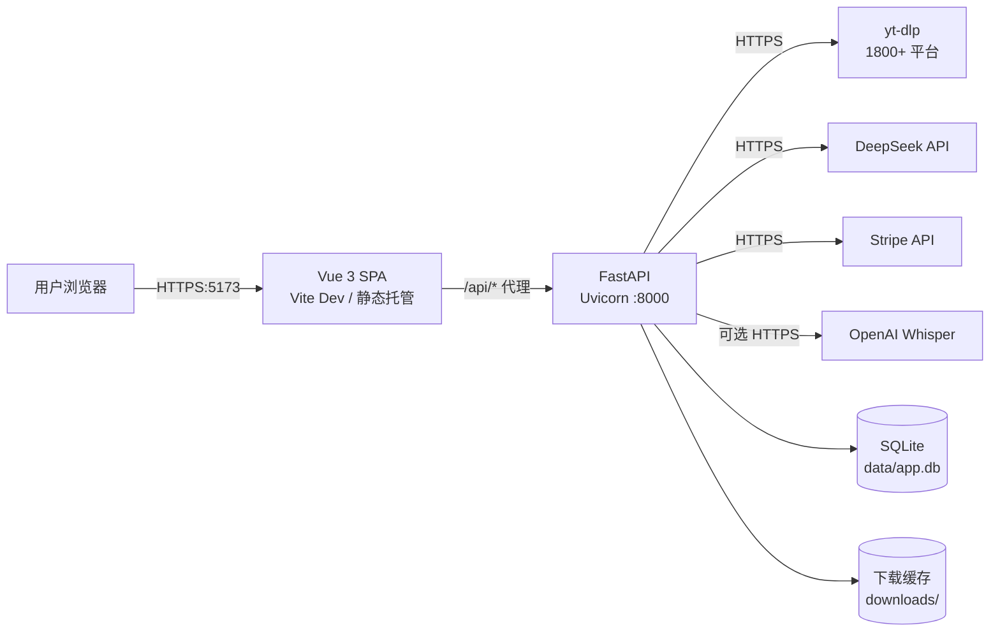

# VidDigest 运维手册

> 本文档面向**运维 / 部署 / 故障排查**场景。开发期的快速启动请看 [README.md](../README.md)，API 细节请看 [API.md](API.md)。

> ⚠️ **会员制已停用（代码保留）**：项目当前不做会员制，所有用户统一为每日 3 次免费额度。
> 前端付费入口由 `frontend/src/config/features.js` 的 `MEMBERSHIP_ENABLED = false` 关闭。
> 后端 `api_payment.py`、`is_vip_active()`、`orders` 表与 Stripe 相关配置**均保留未删**，
> 恢复会员制时把该开关改回 `true` 即可。下方涉及 Stripe 的章节仅供恢复时参考，当前无需配置。

---

## 📑 目录

- [1. 部署架构](#1-部署架构)
- [2. 环境要求](#2-环境要求)
- [3. 首次部署](#3-首次部署)
- [4. 配置说明](#4-配置说明)
- [5. 启动 / 关停 / 重启](#5-启动--关停--重启)
- [6. 进程管理（hub）](#6-进程管理hub)
- [7. 日志与监控](#7-日志与监控)
- [8. 数据与备份](#8-数据与备份)
- [9. 故障排查手册](#9-故障排查手册)
- [10. 性能与限流](#10-性能与限流)
- [11. 安全清单](#11-安全清单)
- [12. 升级与维护](#12-升级与维护)

---

## 1. 部署架构



**核心进程**


| 进程             | 端口   | 依赖                                   | 备注                |
| :--------------: | :----: | ------------------------------------ | ----------------- |
| `backend-api`  | 8000 | Python 3.10+ / yt-dlp / DeepSeek Key | FastAPI + Uvicorn |
| `frontend-dev` | 5173 | Node 18+                             | 仅开发期使用，生产替换为静态文件  |


**生产部署时**：前端 `npm run build` → `dist/` 由 Nginx 托管；后端用 Gunicorn + Uvicorn worker 或单进程 Uvicorn + 反向代理。

---

## 2. 环境要求


| 组件      | 最低版本 | 推荐         | 验证命令                |
| ------- | :----: | :----------: | ------------------- |
| Python  | 3.10 | 3.11       | `python --version`  |
| Node.js | 18   | 20 / 22    | `node --version`    |
| npm     | 9    | 10+        | `npm --version`     |
| ffmpeg  | 任意   | 最新稳定       | `ffmpeg -version`   |
| SQLite  | 3.x  | 系统自带       | `sqlite3 --version` |
| 磁盘      | —    | ≥ 10 GB 可用 | `downloads/` 会持续增长  |


**系统级依赖**

```bash
# Windows（管理员 PowerShell）
choco install ffmpeg        # 或手动下载 → 解压 → 把 bin/ 加入 PATH

# macOS
brew install ffmpeg

# Debian/Ubuntu
sudo apt update && sudo apt install -y ffmpeg sqlite3
```

> **ffmpeg 必须**：用于合并 YouTube/B站等分离的视频流（`bestvideo+bestaudio`），缺失会降级为单格式，可能没声音。

---

## 3. 首次部署

### 3.1 拉取代码

```bash
git clone <your-repo-url> viddigest
cd viddigest
```

### 3.2 后端

```bash
cd backend

# 1) 建虚拟环境
python -m venv venv

# 2) 升级 pip + 装依赖
# Windows（绝对路径绕开中文 cwd 转义问题）
"D:/path/to/backend/venv/Scripts/python.exe" -m pip install --upgrade pip
"D:/path/to/backend/venv/Scripts/python.exe" -m pip install -r requirements.txt

# Linux/macOS
source venv/bin/activate
pip install --upgrade pip
pip install -r requirements.txt

# 3) 复制环境变量模板
cp .env.example .env       # Linux/macOS
# Windows: copy .env.example .env

# 4) 编辑 .env 填入密钥（见 §4）
```

### 3.3 前端

```bash
cd frontend
npm install
```

### 3.4 健康检查

```bash
# 后端
curl http://127.0.0.1:8000/api/health        # → {"status":"ok"}

# 前端（开发期）
curl -o /dev/null -w "%{http_code}" http://127.0.0.1:5173/   # → 200
```

---

## 4. 配置说明

**配置文件**：`backend/.env`（**已在 `.gitignore` 中，不要提交真实密钥**）

### 4.1 变量清单


| 变量                        | 必填  | 默认值                                                 | 用途                                      | 获取                                                                               |
| ------------------------- | :---: | --------------------------------------------------- | --------------------------------------- | -------------------------------------------------------------------------------- |
| `ALIYUN_BAILIAN_API_KEY`  | ✅   | —                                                   | AI 总结 / 导图 / 问答（推荐，最便宜）                 | [https://bailian.console.aliyun.com/](https://bailian.console.aliyun.com/)       |
| `ALIYUN_BAILIAN_BASE_URL` | —   | `https://dashscope.aliyuncs.com/compatible-mode/v1` | 百炼兼容模式端点                                | 用 workspace 专属地址                                                                 |
| `ALIYUN_BAILIAN_MODEL`    | —   | `qwen-turbo`                                        | 模型名（`qwen-turbo` 最便宜，`qwen-plus` 性价比最高） | 百炼模型市场                                                                           |
| `DEEPSEEK_API_KEY`        | ✅   | —                                                   | AI 总结 / 导图 / 问答（兼容旧配置）                  | [https://platform.deepseek.com/api_keys](https://platform.deepseek.com/api_keys) |
| `JWT_SECRET`              | ⚠️  | ``           | JWT 签名密钥                                | 自定义 32+ 位随机串                                                                     |
| `OPENAI_API_KEY`          | —   | —                                                   | 视频无字幕时 Whisper ASR 回退                   | [https://platform.openai.com/api-keys](https://platform.openai.com/api-keys)     |
| `STRIPE_SECRET_KEY`       | —   | —                                                   | 支付服务接入                                  | [https://dashboard.stripe.com/apikeys](https://dashboard.stripe.com/apikeys)     |
| `STRIPE_PRICE_ID_MONTHLY` | —   | —                                                   | 月订阅价格 ID                                | Stripe Dashboard → Products                                                      |
| `STRIPE_WEBHOOK_SECRET`   | —   | —                                                   | Webhook 验签                              | Stripe Dashboard → Webhooks                                                      |
| `FRONTEND_URL`            | —   | `http://localhost:5173`                             | 支付成功跳转                                  | 按实际前端地址填                                                                         |


### 4.2 模板

```env
# ─── AI（必填，配置任一组即可；阿里云百炼最便宜）──
# 阿里云百炼：填写 ALIYUN_BAILIAN_API_KEY 即可，默认模型 qwen-turbo
ALIYUN_BAILIAN_API_KEY=sk-your-bailian-key
ALIYUN_BAILIAN_MODEL=qwen-turbo
# 兼容旧配置：DeepSeek（如已配置会被自动识别，无需删除）
DEEPSEEK_API_KEY=

# ─── 安全（强烈建议改）─────────────────────────
JWT_SECRET=$(openssl rand -hex 32)        # 生成 64 位随机串

# ─── 支付（可选）───────────────────────────────
STRIPE_SECRET_KEY=sk_test_xxx
STRIPE_PRICE_ID_MONTHLY=price_xxx
STRIPE_WEBHOOK_SECRET=whsec_xxx
FRONTEND_URL=https://your-domain.com

# ─── ASR 回退（可选）──────────────────────────
OPENAI_API_KEY=sk-your-openai-key
```

### 4.3 配置生效


| 方式                            | 是否需要重启                        |
| ----------------------------- | :-----------------------------: |
| 编辑 `backend/.env`             | **是**（`python-dotenv` 在启动时加载） |
| 操作系统环境变量                      | **是**                         |
| 容器化部署时 K8s ConfigMap / Secret | **是**（滚动重启）                   |


---

## 5. 启动 / 关停 / 重启

### 5.1 后端

```bash
cd backend

# ── 方式 A：hub 后台托管（推荐） ──
hub start --name backend-api \
  --application "D:/path/to/backend/venv/Scripts/python.exe" \
  --args "-m uvicorn main:app --host 0.0.0.0 --port 8000" \
  --cwd "D:/path/to/backend" \
  --ready "log=Uvicorn running on" --port 8000

# Linux 等价
hub start --name backend-api \
  --application "$(pwd)/venv/bin/python" \
  --args "-m uvicorn main:app --host 0.0.0.0 --port 8000" \
  --cwd "$(pwd)" \
  --ready "log=Uvicorn running on" --port 8000

# ── 方式 B：前台跑（看实时日志） ──
python -m uvicorn main:app --host 0.0.0.0 --port 8000
# Ctrl+C 退出

# ── 方式 C：项目入口 ──
python main.py

# ── 重启（改了代码） ──
hub restart --name backend-api

# ── 关停 ──
hub stop --name backend-api
```

### 5.2 前端

```bash
cd frontend

# ── 方式 A：hub 后台托管 ──
# ⚠️ 中文路径 + npx 会触发 PTY \0 注入 bug，必须用绝对路径 node
hub start --name frontend-dev \
  --application node \
  --args "node_modules/vite/bin/vite.js --host 0.0.0.0 --port 5173 --strictPort" \
  --cwd "D:/path/to/frontend" \
  --ready "log=VITE.*ready" --port 5173

# ── 方式 B：npm scripts ──
npm run dev                                  # 5173，被占时自动跳端口
npm run dev -- --port 5173 --strictPort      # 强占 5173
npm run dev -- --host 0.0.0.0                # 局域网可访问

# ── 生产构建 ──
npm run build       # → dist/，由 Nginx/CDN 托管
npm run preview     # 本地预览生产构建

# ── 重启（改了 vite.config.js 才需要，普通代码 HMR 自动刷新） ──
hub restart --name frontend-dev

# ── 关停 ──
hub stop --name frontend-dev
```

### 5.3 一键全启 / 全停

```bash
# 全启
hub start --name backend-api --application "<venv-python>" --args "-m uvicorn main:app --host 0.0.0.0 --port 8000" --cwd "<backend-dir>" --ready "log=Uvicorn running on" --port 8000
hub start --name frontend-dev --application node --args "node_modules/vite/bin/vite.js --host 0.0.0.0 --port 5173 --strictPort" --cwd "<frontend-dir>" --ready "log=VITE.*ready" --port 5173

# 全停
hub stop --name backend-api
hub stop --name frontend-dev
```

### 5.4 systemd 守护（Linux 生产）

`/etc/systemd/system/<app>-backend.service`：

```ini
[Unit]
Description=VidDigest Backend (FastAPI)
After=network.target

[Service]
Type=simple
User=www-data
WorkingDirectory=/opt/<app>/backend
Environment="ALIYUN_BAILIAN_API_KEY=sk-xxx"
Environment="JWT_SECRET=xxx"
ExecStart=/opt/<app>/backend/venv/bin/python -m uvicorn main:app --host 0.0.0.0 --port 8000 --workers 2
Restart=on-failure
RestartSec=5

[Install]
WantedBy=multi-user.target
```

```bash
sudo systemctl daemon-reload
sudo systemctl enable --now <app>-backend
sudo systemctl status <app>-backend
```

### 5.5 测试账号（演示 / 压测 / 联调用）

> 项目内置两个长期可用的测试账号，覆盖**普通用户 + VIP**两类典型场景。
> `.test` 是 RFC 6761 保留 TLD，不会被真实邮件系统处理，可放心写入文档。


| 邮箱                   | 密码          | VIP  | AI 配额 | 用途                          |
| -------------------- | ----------- | :----: | :-----: | --------------------------- |
| `test@example.org` | `[已移除的测试口令]` | ❌    | 3 次/日 | 测试免费用户配额限制、付费引导弹窗、错误文案      |
| `vip@example.org`  | `[已移除的测试口令]`  | ✅ 永久 | 无限    | 测试 VIP 全功能（无限制总结 / 导图 / 问答） |


**VIP 账号说明**：`vip_expire_at` 设为 `2099-12-31`，实质上等于永久有效。生产环境请勿沿用。

**首次部署后自动创建（如未自动创建，手动执行）**

```bash
# 1) 注册两个普通账号（走标准 /api/auth/register，密码经 bcrypt 哈希）
curl -X POST http://127.0.0.1:8000/api/auth/register \
  -H "Content-Type: application/json" \
  -d '{"email":"test@example.org","password":"[已移除的测试口令]"}'

curl -X POST http://127.0.0.1:8000/api/auth/register \
  -H "Content-Type: application/json" \
  -d '{"email":"vip@example.org","password":"[已移除的测试口令]"}'

# 2) 将 vip 账号升级为 VIP（直接改库，绕开 Stripe）
"D:/path/to/backend/venv/Scripts/python.exe" - <<'PY'
import sqlite3
conn = sqlite3.connect('D:/path/to/backend/data/app.db')
conn.execute(
    "UPDATE users SET is_vip=1, vip_expire_at='2099-12-31 23:59:59' WHERE email='vip@example.org'"
)
conn.commit()
conn.close()
print('✓ vip@example.org 已升级为 VIP')
PY
```

**重置账号（如被压测数据污染）**

```bash
# 删掉两个测试账号，重新跑上面的"首次部署"脚本
"D:/path/to/backend/venv/Scripts/python.exe" - <<'PY'
import sqlite3
conn = sqlite3.connect('D:/path/to/backend/data/app.db')
conn.execute("DELETE FROM users WHERE email LIKE '%@example.org'")
conn.commit()
conn.close()
print('✓ 测试账号已清空')
PY
```

**自动化测试**：CI 环境可直接用 `test@example.org` 跑权限校验类用例；用 `vip@example.org` 跑配额无限制场景。注意免费用户每天解析 3 次、追问 10 次（见 §10.3），连续跑测试前先把 `VIDDIGEST_DAILY_PARSE_LIMIT` / `VIDDIGEST_DAILY_CHAT_LIMIT` 调大，或清掉 `daily_parse_count` / `daily_chat_count` 字段。

## 6. 进程管理（hub）

`hub` 是 omp 自带的进程编排器，所有长跑进程都应托管在它下面。

### 6.1 常用命令


| 命令                                                                                     | 作用                      |
| -------------------------------------------------------------------------------------- | ----------------------- |
| `hub start --name <n> --application <exe> --args <argv...> --cwd <dir> --ready <expr>` | 启动并等待就绪                 |
| `hub stop --name <n>`                                                                  | 优雅停止（SIGTERM → SIGKILL） |
| `hub restart --name <n>`                                                               | 复用启动配置重启                |
| `hub ps`                                                                               | 列出当前项目托管的所有进程           |
| `hub describe --name <n>`                                                              | 查看启动参数 + 状态             |
| `hub logs --name <n>`                                                                  | 最近 100 行日志              |
| `hub logs --name <n> --follow`                                                         | 实时跟随日志                  |
| `hub logs --name <n> --grep "ERROR"`                                                   | 过滤关键字                   |
| `hub send --name <n> --text "..."`                                                     | 给进程 stdin 发命令           |


### 6.2 启动配置示例

```bash
# --ready 同时匹配日志 + 端口，两个条件都必须满足才视为就绪
hub start --name backend-api \
  --application "D:/path/venv/Scripts/python.exe" \
  --args "-m uvicorn main:app --host 0.0.0.0 --port 8000" \
  --cwd "D:/path/backend" \
  --ready "log=Uvicorn running on" --port 8000 \
  --restart on-failure
```


| `--restart`  | 行为             |
| ------------ | -------------- |
| `no`（默认）     | 失败不重启          |
| `on-failure` | 异常退出自动重启（指数退避） |
| `always`     | 不管退出码都重启       |


### 6.3 故障排查起步

```bash
hub ps                              # 看进程状态 / uptime / restarts
hub describe --name backend-api     # 看启动参数是否正确
hub logs --name backend-api --tail 200 --grep "ERROR"
hub logs --name backend-api --follow
```

---

## 7. 日志与监控

### 7.1 日志位置


| 来源           | 位置                                         | 用途              |
| ------------ | ------------------------------------------ | --------------- |
| backend-api  | `hub logs --name backend-api`              | Uvicorn 访问 + 异常 |
| frontend-dev | `hub logs --name frontend-dev`             | Vite HMR + 编译错误 |
| yt-dlp 调试    | 设环境变量 `YT_DLP_OUTPUT=downloads/yt-dlp.log` | 抓取失败详情          |
| SQLite       | `backend/data/app.db`                      | 用户 / 订单 / 摘要计数  |


### 7.2 关键监控点

```bash
# 1) 后端存活
curl -fs http://127.0.0.1:8000/api/health || alert "Backend down"

# 2) 前端可达
curl -fs -o /dev/null http://127.0.0.1:5173/ || alert "Frontend down"

# 3) 代理链路
curl -fs http://127.0.0.1:5173/api/health || alert "Vite proxy broken"

# 4) 磁盘空间（downloads 增长快）
du -sh backend/downloads/ && df -h backend/

# 5) 数据库大小
ls -lh backend/data/app.db

# 6) yt-dlp 更新（每月一次）
"D:/path/venv/Scripts/python.exe" -m pip install --upgrade yt-dlp
```

### 7.3 推荐告警阈值


| 指标                        | 阈值          | 处置                   |
| ------------------------- | ----------- | -------------------- |
| `backend-api` uptime 重启次数 | 1h 内 ≥ 3 次  | 看 `hub logs` 查 panic |
| `/api/health` 连续失败        | 30s 内 3 次   | 重启后端                 |
| `downloads/` 大小           | &gt; 10 GB  | 清理旧文件                |
| `data/app.db` 大小          | &gt; 500 MB | 归档 + 重建索引            |
| 磁盘剩余                      | &lt; 10%    | 紧急清理                 |


---

## 8. 数据与备份

### 8.1 数据位置


| 数据             | 路径                       | 是否备份          |
| -------------- | ------------------------ | :-------------: |
| 用户 / 订单 / 摘要计数 | `backend/data/app.db`    | ✅             |
| 下载缓存           | `backend/downloads/`     | ⛔ 可重建         |
| yt-dlp 缓存      | 用户家目录 `~/.cache/yt-dlp/` | ⛔ 可重建         |
| `.env`         | `backend/.env`           | ✅ **绝不入 git** |


### 8.2 备份策略

```bash
# 每日凌晨 3 点归档（crontab 示例）
0 3 * * * sqlite3 /opt/<app>/backend/data/app.db ".backup '/backup/<app>-$(date +\%Y\%m\%d).db'"

# 手动备份
cp backend/data/app.db backup/app-$(date +%Y%m%d).db

# 手动恢复
cp backup/app-20260101.db backend/data/app.db
hub restart --name backend-api
```

### 8.3 重置数据库

```bash
# ⚠️ 会清空所有用户、订单、摘要计数
rm -f backend/data/app.db
hub restart --name backend-api      # lifespan 启动时会自动重建表结构
```

---

## 9. 故障排查手册

### 9.1 启动类


| 症状                                               | 原因                     | 解决                                                                       |
| ------------------------------------------------ | ---------------------- | ------------------------------------------------------------------------ |
| `ModuleNotFoundError: No module named 'fastapi'` | venv 没建 / 没装           | `venv/Scripts/python -m pip install -r requirements.txt`                 |
| `python: can't open file 'main.py'`              | cwd 错误                 | `cd backend` 后再启动                                                        |
| uvicorn 端口被占                                     | 8000 被别的进程占            | `netstat -ano | grep 8000` 杀 PID 或换 `--port 8001`                        |
| vite 端口跳到 5174/5175                              | 5173 被旧实例占             | `taskkill /F /PID <pid>` + 加 `--strictPort`                              |
| hub 启动报 `CreateProcessW ... 不是有效的 Win32 应用程序`    | 中文 cwd + npx 触发 \0 bug | 用绝对路径 `node node_modules/vite/bin/vite.js`                               |
| `AI 服务 API Key 未设置`                              | `.env` 缺失或没填           | 复制 `.env.example` → 填 `ALIYUN_BAILIAN_API_KEY` 或 `DEEPSEEK_API_KEY` → 重启 |
| `JWT_SECRET` 默认值告警                               | 生产环境忘改                 | `openssl rand -hex 32` 生成 64 位随机串                                        |


### 9.2 运行时类


| 症状                                          | 原因                        | 解决                                  |
| ------------------------------------------- | ------------------------- | ----------------------------------- |
| 前端 `404 Not Found` 但后端 200                  | vite 代理被旧实例顶掉             | `taskkill` 旧 vite → 重启 frontend-dev |
| `GET /api/health` 通过 5173 代理 404            | 同上                        | 同上                                  |
| 视频解析失败 `Unable to extract ...`              | yt-dlp 版本过期               | `pip install --upgrade yt-dlp`      |
| 下载视频有画面无声音                                  | 没装 ffmpeg                 | 安装 ffmpeg 并加入 PATH                  |
| `抖音解析失败`                                    | 短链过期 / 接口变更               | 重试 + 升级 yt-dlp                      |
| AI 总结 `请先登录`                                | 未鉴权                       | 注册 / 登录后重试                          |
| AI 总结 `今日次数已用完`                             | 免费配额 3 次/日                | 等次日重置（当前无会员制）                   |
| AI 总结 `没有可用的字幕`                             | 视频无字幕轨                    | 上传视频不会支持；选有字幕的视频                    |
| AI 总结无响应 / 卡住                               | DeepSeek 限流 / 网络          | 看 `hub logs` + 重试                   |
| Stripe 支付 500                               | 缺少 `STRIPE_SECRET_KEY`    | 填 `.env` 并重启                        |
| Webhook 400 `Webhook secret not configured` | 缺 `STRIPE_WEBHOOK_SECRET` | 同上                                  |
| 注册 400 `邮箱或密码错误`                            | 用 username 而不是 email      | 必须用邮箱登录                             |
| Bearer token 401 但 token 复制正确               | curl 在 Windows 长 token 截断 | 用 httpx / Postman / 浏览器测试           |


### 9.3 网络类


| 症状                 | 原因                      | 解决                                                                            |
| ------------------ | ----------------------- | ----------------------------------------------------------------------------- |
| yt-dlp 调用平台超时      | 国内访问 YouTube/Twitter 困难 | 配置代理：环境变量 `HTTPS_PROXY=http://127.0.0.1:<proxy-port>`                                 |
| DeepSeek 502 / 超时  | DeepSeek 服务端问题          | 重试；切换 OpenAI 兼容接口                                                             |
| Stripe webhook 收不到 | 公网回调不通                  | 用 `stripe listen --forward-to http://127.0.0.1:8000/api/payment/webhook` 本地测试 |


### 9.4 数据类


| 症状                   | 原因               | 解决                                    |
| -------------------- | ---------------- | ------------------------------------- |
| `database is locked` | SQLite 多写并发      | 加 `--workers 1`（默认即如此）                |
| 用户列表错乱               | 升级数据库 schema 没迁移 | 看 `database.py` 是否有 `ALTER TABLE`，手动补 |
| **AI 总结一直"正在分析"但无任何事件** | `vip_expire_at` 是 naive datetime，`fromisoformat` 后与 `datetime.now(timezone.utc)` 比较直接 TypeError；异常发生在 SSE `try` 块**之前**，前端拿不到 error 事件就一直转圈 | 已修复：`database.py:check_and_increment_summary` 和 `_fulfill_order` 都加了 `if expire.tzinfo is None: expire = expire.replace(tzinfo=timezone.utc)` 兜底。**根治方案**：所有 `vip_expire_at` 写入统一使用 `datetime.now(timezone.utc).isoformat()`（带 `+00:00`） |


---

## 10. 性能与限流

### 10.1 当前瓶颈

- **yt-dlp 解析**：单次 2-8s，受平台反爬影响
- **DeepSeek 流式生成**：受 prompt 长度 + token 速率影响，通常 10-30s
- **下载文件大小**：受 `downloads/` 磁盘限制

### 10.2 调优建议


| 场景           | 调优                                                    |
| ------------ | ----------------------------------------------------- |
| 高并发解析        | uvicorn 启动加 `--workers 4`（注意 SQLite 写并发）              |
| 下载慢          | 上 CDN / 引导用户用直链 `/api/direct-url`                     |
| AI 总结排队      | 换 PostgreSQL + Celery；当前是同步 + SSE                     |
| downloads 爆盘 | 加 cron `find backend/downloads -mtime +1 -delete` 每天清 |


### 10.3 免费用户配额

由**环境变量**控制，改后重启后端生效（发版前在 `backend/.env` 里设）：

| 环境变量 | 默认 | 管什么 |
|:--|--:|:--|
| `VIDDIGEST_DAILY_PARSE_LIMIT` | 3 | 每日可发起的解析次数（产出总结 + 思维导图 + 标签） |
| `VIDDIGEST_DAILY_CHAT_LIMIT` | 10 | 每日可发起的追问次数 |

两个计数器彼此独立、各自按 UTC 日期重置。共享内容（读社区视频的总结、思维导图、标签、字幕）不消耗任何额度。

调参入口是环境变量，不是 `database.py` 里的常量——改常量会在下一次改代码时被覆盖。

---

## 11. 安全清单


| 项                          | 状态  | 建议                                 |
| -------------------------- | :---: | ---------------------------------- |
| `JWT_SECRET` 不使用默认值        | ⚠️  | 生产改 32+ 随机串                        |
| `.env` 不入 git              | ✅   | `.gitignore` 已包含                   |
| CORS `allow_origins=["*"]` | ⚠️  | 生产改为具体域名                           |
| bcrypt 哈希密码                | ✅   | cost=12 默认                         |
| JWT 过期 72h                 | ✅   | 短 token + refresh token 更安全        |
| Stripe Webhook 验签          | ✅   | `STRIPE_WEBHOOK_SECRET` 必填         |
| 上传文件大小限制                   | ✅   | FastAPI 默认                         |
| HTTPS                      | ⚠️  | 生产必须（Nginx + Let's Encrypt）        |
| API Key 不暴露前端              | ✅   | 只走后端                               |
| 速率限制                       | ⛔   | 当前未做，建议加 slowapi / Nginx limit_req |


**生产前必做**：

```bash
# 1) 生成强 JWT 密钥
openssl rand -hex 32

# 2) 改 CORS 允许的来源（main.py）
allow_origins=["https://your-domain.com"]

# 3) 启用 HTTPS（Nginx 配置示例）
server {
  listen 443 ssl;
  server_name api.your-domain.com;
  ssl_certificate /etc/letsencrypt/live/api.your-domain.com/fullchain.pem;
  ssl_certificate_key /etc/letsencrypt/live/api.your-domain.com/privkey.pem;

  location / {
    proxy_pass http://127.0.0.1:8000;
    proxy_set_header Host $host;
    proxy_set_header X-Real-IP $remote_addr;
    proxy_set_header X-Forwarded-For $proxy_add_x_forwarded_for;
    proxy_set_header X-Forwarded-Proto $scheme;
  }
}
```

---

## 12. 升级与维护

### 12.1 依赖升级

```bash
# 后端
"D:/path/venv/Scripts/python.exe" -m pip install --upgrade pip
"D:/path/venv/Scripts/python.exe" -m pip install --upgrade -r requirements.txt

# 前端
cd frontend && npm update
npm outdated       # 看哪些有更新

# 强制升级 yt-dlp（解决平台兼容问题最常见）
"D:/path/venv/Scripts/python.exe" -m pip install --upgrade yt-dlp
```

### 12.2 数据库迁移

当前用 SQLite + 应用启动时 `init_db()` 建表。schema 变更时：

1. 改 `database.py` 中建表语句
2. 或加兼容的 `ALTER TABLE` 逻辑
3. 重启服务

### 12.3 回滚

```bash
# 代码回滚
git log --oneline -10
git checkout <commit-hash> -- backend/ frontend/
hub restart --name backend-api
hub restart --name frontend-dev

# 数据库回滚
cp backup/app-20260101.db backend/data/app.db
hub restart --name backend-api
```

### 12.4 升级 checklist

- [ ] 备份 `data/app.db`
- [ ] 备份 `.env`
- [ ] 看 `CHANGELOG` / Git log 是否有破坏性变更
- [ ] 在 staging 环境跑通
- [ ] 生产滚动升级（先停前端再停后端，避免半截状态）
- [ ] 验证 `/api/health` + 主页 + 注册登录 + 一次完整下载 + 一次 AI 总结

---

## 🆘 紧急联系


| 问题类型  | 排查入口                                                                                                       |
| ----- | ---------------------------------------------------------------------------------------------------------- |
| 服务挂了  | `hub ps` → `hub describe` → `hub logs --follow`                                                            |
| 接口异常  | `curl -v` + 看 `hub logs --grep ERROR`                                                                      |
| 平台兼容  | 升级 yt-dlp + 提交 Issue                                                                                       |
| AI 不通 | 看 `ALIYUN_BAILIAN_API_KEY` / `DEEPSEEK_API_KEY` 是否过期 / 余额；百炼要确认 `ALIYUN_BAILIAN_BASE_URL` 是 workspace 专属地址 |
| 数据丢失  | 从 `backup/app-*.db` 恢复                                                                                     |


---

<p align="center"><sub>文档版本 1.0 · 最后更新 2026-09-08</sub></p>